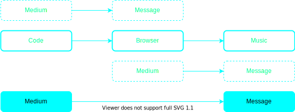

# Why should we make music in the browser?

I will look at this question from three different angles, through three different quotes of three different theorists.

## Part 1 - McLuhan

To find a question to this answer we can look one of the most important quotes of modern media theory.

> The medium is the message.

\- Marshall McLuhan
{: .caption} 

This quote is the essence of what media theory is about. While McLuhan certainly doesn't think the medium is the **whole** message, he states that the effect of the medium is by far greater than that of its content, which is merely incidental. As he says: The fact that we have the technology of TV has a tremendous effect on the world, how we communicate and how we ultimately develop as a society and individuals. What we print doesn't as matter as much as the printed word. The existence of the telephone affects everyone, what you say on the telephone affects very few people.

While this is certainly true to some extent, I do not think that we can dismiss the content of media as simply incidental. McLuhan says that he doesn't want to make value judgments about media, but if you listen to him talk you will notice that his tone suggests something different. When asked about public television, he replies that it is boring and eventually unsustainable because it doesn't care about the people who watch it. If a private company finances a TV program, they have an interest in the program reaching a lot of people, so they have an interest in making media "for the people", which is absurd and completely dismisses the systemic issues in how media us used by companies to manipulate everything consumption behavior to political views to serve their interests. He does address it a little bit though.[^mcluhan] [^mcluhan-podcast]

Still, from this realization that the medium at least shapes the message, we can draw two conclusions for us as artists. 

First: The medium through which we express our art matters. A vinyl record is something different than a digital stream. A book is something different than a movie. Certain things can't be expressed in a book that can in a movie and vice versa.

Second: If certain media allows us to express things that others don't, then we can also create new forms of art through new media/technologies. Again this is very obvious: Electronic music can only exist because we have devices that are capable of producing electronic sounds.

If we strive to push art to its boundaries, the engagement with contemporary technology - or refusal thereof - becomes almost a necessity.

`Based on some other canadian dude that says basically that a society is defined by the way it communicates, this is in the podcast, listen to it again.`

Media and message aren't exactly opposites or mutually exclusive: A medium can always become a message in another context. Think about this example: A score can be a medium in which music is the message. Music then again can be a medium through which we can express emotions or abstract ideas.

In our current situation I'm interested in the following relationship between medium and message:

Not because the browser is not interesting or important, but because code is the foundation through which we compose music in the browser. The browser has a great importance in our life. Its the portal through which we access the internet, so much so that for a lot of people its synonymous with the internet. But many of the layers that the browser adds to our composition process are of political or social nature, not so much compositional. Sure the browser allows us to make systems that are distributed over a network - and this is of course very interesting - but these connected nodes (or whatever you want to call them) are still defined through code. But in addition to that, the browser is also the reason why we have to use JavaScript, which again has huge implications on the way we write code and I will talk about that a bit later.

## Part 2 - Benjamin

In his famous essay "The Work of Art in the Age of Mechanical Reproduction" Walter Benjamin talks about the transition art undergoes by entering media which is mechanically reproducible. What this means for him is that the artwork looses its aura:

>Even the most perfect reproduction of a work of art is lacking in one element: its presence in time and space, its unique existence at the place where it happens to be. This unique existence of the work of art determined the history to which it was subject throughout the time of its existence. [...] One might subsume the eliminated element in the term “aura” and go on to say: that which withers in the age of mechanical reproduction is the aura of the work of art.

\- Walter Benjamin 
{: .caption}

But Benjamin is by no means mourning the loss of the aura. The aura is an expression of distance and authority of an artwork. In the age of manual reproduction, the reproduction is essentially a forgery and has no authenticity, because authenticity is outside of the sphere of manual or technical reproduction. Aura seems to be only possible through authenticity.

Distance, no matter how near the work of art is, is also an expression of aura. Since the traditional art work is a unique existence in time and space, this distance also exists in time and space. Think about standing in front of the Mona Lisa, no matter how close you can get, you can never touch it and even if you could, would you feel like touching its aura? Also the art is fixed in space, and you have to go there and "meet" it, this establishes also a form of hierarchy. The mechanically reproduced artwork however "meets the beholder half way". The traditional art work is also determined by the history to which it is a subject in the time of its existence. This can too create a distance in time between the art and its beholder.

Through this capability of reproduction the art becomes available to the masses, which for Benjamin holds a lot of potential.

If we look at where we are at now, I would argue that we have yet again entered a different age. 

--> aura is lost
--> aura is a thing of distance and authority
--> art becomes accessible to the masses

--> whether or not we perceive the loss of the aura as something good or bad, we can not deny it is a fundamental, conceptual difference in the way we perceive art.

--> now we live in the age of not only the digital reproduction of art, but the digital generation of art.
--> this shift is much more significant than the shift from mechanical to digital.
--> generative music is not new though, its a tradition from cage, to serialism to algorithmic composition
    ---> conceptually closest is probably the principle of a sound-walk. the randomness in a sound-walk is not really different from the one in a computer if we subscribe to a deterministic universe.
    more performance art in general than sound walks, has an abstract idea, an unique execution and can't be preserved.

--> I make a distinction between algorithmic composition and generative music
    ---> algorithmic composition is music composed by a computer, but does not express itself as a generative system
    ---> generative music is music generated by a computer and only exists in a generative context. there is an interesting thing here: what benjamin describes about traditional art is exactly true about early generative pieces, being played in a museum setting.

--> alex bainter quote masterarbeit, what seperates the browser is that it is the environment that makes it possible

## Part 3 - Adorno

---> Adorno is a strong critic of mass culture, Benjamin thinks it has potential to destroy itself in the same way that within capitalism there is the potential to destroy captialism (Engels).

power structures

## Media Art

Media Art is a practice of art that takes these theoretical

--> how does code work, what are its possibilities?

[^mcluhan]: Marshall McLuhan, The medium is the message, Monday Conference on ABC TV, https://www.youtube.com/watch?v=UoCrx0scCkM

[^mcluhan-podcast]: https://theoretician.podbean.com/e/the-medium-is-the-message-marshall-mcluhan-keyword/