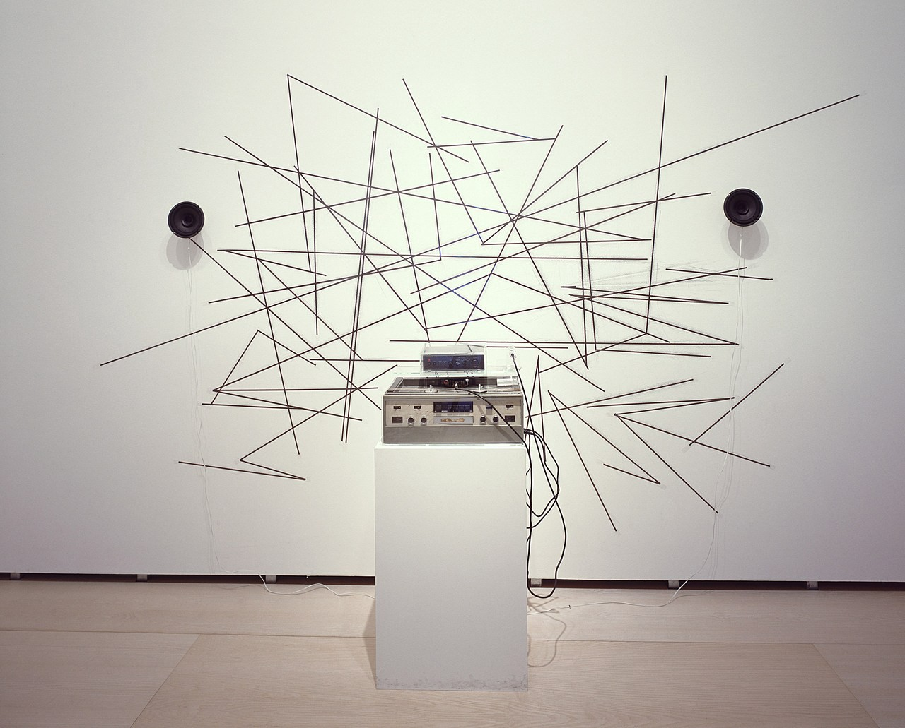

# Why should we make music in the browser?

I will look at this question from three different angles, through three different quotes of three different theorists.

## Part 1 - McLuhan

To find a question to this answer we can look one of the most important quotes of modern media theory.

> The medium is the message.
\- *Marshall McLuhan*

This quote is the essence of what media theory is about. While McLuhan certainly doesn't think the medium is the **whole** message, he states that the effect of the medium is by far greater than that of its content, which is merely incidental. As he says: The fact that we have the technology of TV has a tremendous effect on the world, how we communicate and how we ultimately develop as a society and individuals. What we print doesn't as matter as much as the printed word. The existence of the telephone affects everyone, what you say on the telephone affects very few people.

While this is certainly true to some extent, I do not think that we can dismiss the content of media as simply incidental. McLuhan says that he doesn't want to make value judgments about media, but if you listen to him talk you will notice that his tone suggests something different. When asked about public television, he replies that it is boring and eventually unsustainable because it doesn't care about the people who watch it. If a private company finances a TV program, they have an interest in the program reaching a lot of people, so they have an interest in making media "for the people", which is absurd and completely dismisses the systemic issues in how media us used by companies to manipulate everything consumption behavior to political views to serve their interests. He does address it a little bit though.[^mcluhan] [^mcluhan-podcast]

Still, from this realization that the medium at least shapes the message, we can draw two conclusions for us as artists. 

First: The medium through which we express our art matters. A vinyl record is something different than a digital stream. A book is something different than a movie. Certain things can't be expressed in a book that can in a movie and vice versa.

Second: If certain media allows us to express things that others don't, then we can also create new forms of art through new media/technologies. Again this is very obvious: Electronic music can only exist because we have devices that are capable of producing electronic sounds.

If we strive to push art to its boundaries, the engagement with contemporary technology - or refusal thereof - becomes almost a necessity.

`Based on some other canadian dude that says basically that a society is defined by the way it communicates, this is in the podcast, listen to it again.`

Media and message aren't exactly opposites or mutually exclusive: A medium can always become a message in another context. Think about this example: A score can be a medium in which music is the message. Music then again can be a medium through which we can express emotions or abstract ideas.

In our current situation I'm interested in the following relationship between medium and message:

Not because the browser is not interesting or important, but because code is the foundation through which we compose music in the browser. The browser has a great importance in our life. Its the portal through which we access the internet, so much so that for a lot of people its synonymous with the internet. But many of the layers that the browser adds to our composition process are of political or social nature, not so much compositional. Sure the browser allows us to make systems that are distributed over a network - and this is of course very interesting - but these connected nodes (or whatever you want to call them) are still defined through code. But in addition to that, the browser is also the reason why we have to use JavaScript, which again has huge implications on the way we write code and I will talk about that a bit later.

## Part 2 - Benjamin

soundwalks

## Part 3 - Adorno

power structures

## Media Art

Media Art is a practice of art that takes these theoretical

[^mcluhan]: Marshall McLuhan, The medium is the message, Monday Conference on ABC TV, https://www.youtube.com/watch?v=UoCrx0scCkM

[^mcluhan-podcast]: https://theoretician.podbean.com/e/the-medium-is-the-message-marshall-mcluhan-keyword/